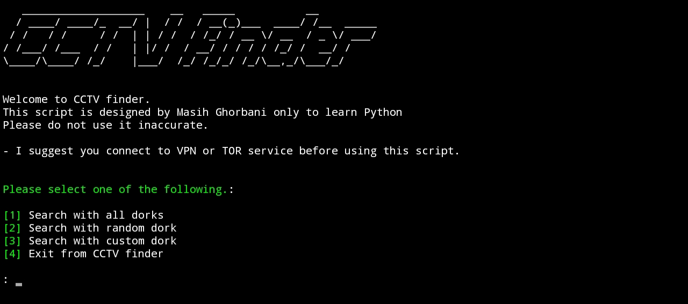
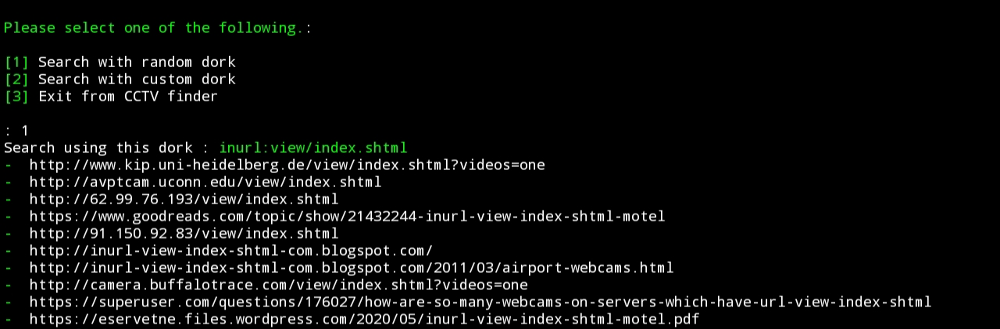

# cctv-finder


This is an open source project that allows you to find vulnerable cameras and watch those videos.

You can run this project in a variety of platforms such as Android, Windows and a variety of GNU / Linux distributions.
 
#  Installation 
 
##  windows 

To run this project on the Windows operating system, you will need to download Python3 from  [python.org](https://python.org/), then install Google ,Pyfiglet and Beautifulsoup4 through the Python Package Manager (PIP) :

```python
pip install beautifulsoup4
```
```python
pip install google
```

```python
pip install pyfiglet 
```

Then download the project from Github and run the cctvfinder.py file and enjoy.

## Linux

To run this project on Linux, you install Python and git using your package manager. And then install Pyfiglet ,Google and Beautifulsoup4 through the Python Package Manager (PIP) :

```python
pip install beautifulsoup4
```
```python
pip install google
```

```python
pip install pyfiglet 
```

Then clone the project from the github.
```git 
git clone https://github.com/masih-dev/cctv-finder.git
```

And finally run the project :
```python
python3 ~/cctv-finder/cctvfinder.py
```

## Android 

A good news! You can run this script on your Android phone! But how? 

just install the Termux program from Play Store, and then type the following commands to install Python and run project: 

```shell
apt update 
```

```shell
apt upgrade 
```

```shell
apt install git python 
```

```git
git clone https://github.com/masih-dev/cctv-finder.git
```

```python
pip install google
pip install pyfiglet 
pip install beautifulsoup4
```
```shell
python3  ~/cctv-finder/cctvfinder.py
```

# Pictures 



